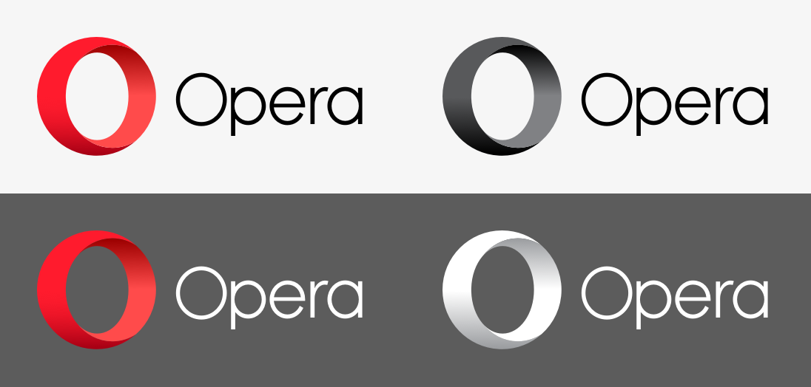
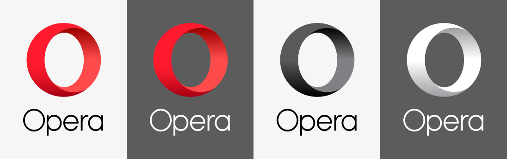
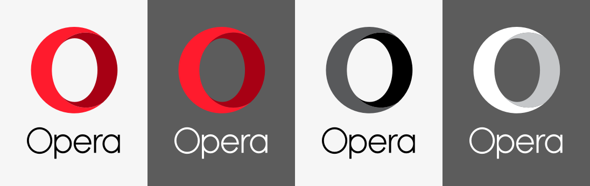
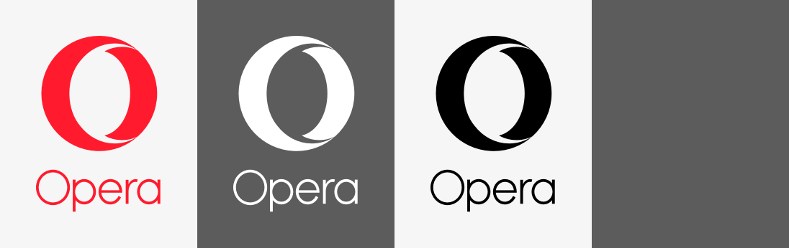

# [Opera Logos](http://operasoftware.github.io/logo/)

## Logo

### Full

SVG: [red](dest/logo/full-red.svg), [white](dest/logo/full-white.svg), [black](dest/logo/full-black.svg).

### Flat

SVG: [red](dest/logo/flat-red.svg), [white](dest/logo/flat-white.svg), [black](dest/logo/flat-black.svg).

### Monochrome

SVG: [red](dest/logo/mono-red.svg), [white](dest/logo/mono-white.svg), [black](dest/logo/mono-black.svg).

## Horizontal

### Full

SVG: [red](dest/horizontal/full-red.svg), [black](dest/horizontal/full-black.svg), [red-white](dest/horizontal/full-red-white.svg), [white](dest/horizontal/full-white.svg).

### Flat

SVG: [red](dest/horizontal/flat-red.svg), [black](dest/horizontal/flat-black.svg), [red-white](dest/horizontal/flat-red-white.svg), [white](dest/horizontal/flat-white.svg).

### Monochrome

SVG: [red](dest/horizontal/mono-red.svg), [black](dest/horizontal/mono-black.svg), [white](dest/horizontal/mono-white.svg).

## Vertical

### Full

SVG: [red](dest/vertical/full-red.svg), [red-white](dest/vertical/full-red-white.svg), [black](dest/vertical/full-black.svg), [white](dest/vertical/full-white.svg).

### Flat

SVG: [red](dest/vertical/flat-red.svg), [red-white](dest/vertical/flat-red-white.svg), [black](dest/vertical/flat-black.svg), [white](dest/vertical/flat-white.svg).

### Monochrome

SVG: [red](dest/vertical/mono-red.svg), [white](dest/vertical/mono-white.svg), [black](dest/vertical/mono-black.svg).

---
Copyright [Opera Software ASA](http://opera.com) © 2015
